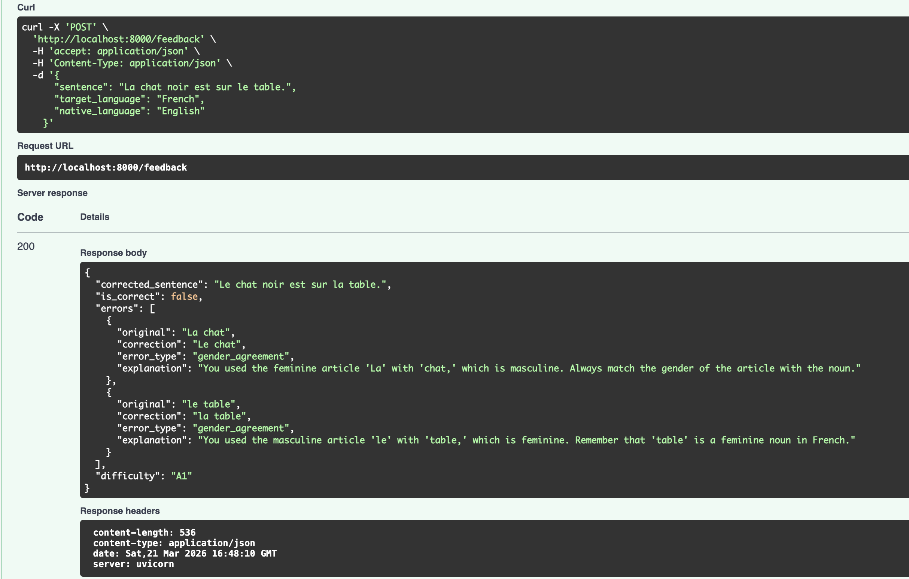
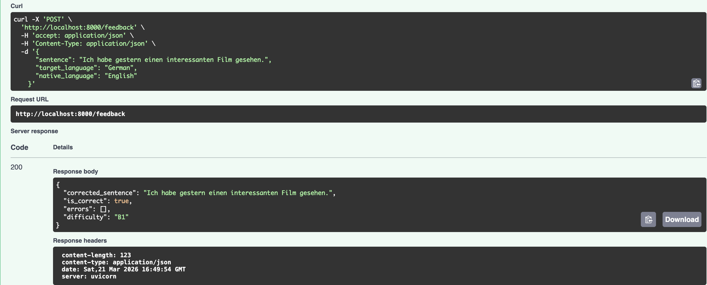

## Language Feedback API

This project is an LLM-powered API that analyzes learner-written sentences and returns structured language feedback.  
Given a sentence, target language, and native language, it provides:

- a minimally corrected sentence
- an `is_correct` flag
- detailed error spans with corrections and error categories
- learner-friendly explanations in the native language
- a CEFR difficulty rating (`A1` to `C2`)

The service is built with FastAPI, supports Anthropic with OpenAI fallback, enforces schema-shaped output, and includes Docker support plus unit/integration/schema tests.

---

## How It Works

A request hits `POST /feedback` with three fields: the learner's sentence, the target language they're studying, and their native language. The API sends this to an LLM with a carefully designed system prompt, validates the structured response, and returns it.

The service also exposes `GET /health` for readiness/liveness checks. It returns HTTP `200` with:

```json
{"status": "ok"}
```

```
Request → Cache key + Cache check → LLM call (Anthropic or OpenAI) → Consistency guards → Pydantic validation → Cache store → Response
                                            ↓ (if Anthropic fails)
                                       OpenAI fallback
```

### Provider Selection and Fallback

The API supports both Anthropic and OpenAI. At startup, it checks which API keys are present:

- If `ANTHROPIC_API_KEY` is set → uses **Claude** as primary
- If that call fails (timeout, rate limit, bad request) → automatically **falls back to OpenAI**
- If only `OPENAI_API_KEY` is set → uses **OpenAI** directly

This means the API stays up even if one provider has an outage.

### Structured Output Enforcement

The response schema (`schema/response.schema.json`) defines exactly what fields, types, and allowed values the response must have — including `enum` constraints on `error_type` (12 allowed categories) and `difficulty` (A1–C2). Both providers enforce this at the API level:

- **Anthropic:** The schema is passed as a tool's `input_schema` with `tool_choice` forced to that tool. The model must output valid JSON matching the schema — it cannot return free-form text.
- **OpenAI:** The schema is passed via `response_format` with `type: "json_schema"` and `strict: True`. Same guarantee, different mechanism.
- I did not change the existing base schema design, I only added `additionalProperties: false` so the provider-facing schema can be enforced strictly and reject unexpected extra fields.

On top of the LLM-level enforcement, Pydantic models in `app/models.py` use `Literal` types for `error_type` and `difficulty`, providing a second validation layer before the response reaches the client.

---

## Project Structure

```text
intern-task-2026/
├── app/                          # API application code
│   ├── __init__.py
│   ├── main.py                   # FastAPI routes and handlers
│   ├── feedback.py               # Prompt, provider calls, cache, fallback
│   └── models.py                 # Pydantic request/response models
├── schema/                       # JSON schemas used for validation
│   ├── request.schema.json
│   └── response.schema.json
├── examples/                     # Example request/response samples
│   └── sample_inputs.json
├── tests/                        # Unit, integration, and schema tests
│   ├── test_feedback_unit.py
│   ├── test_feedback_integration.py
│   └── test_schema.py
├── images/                       # README example output screenshots
│   ├── French.png
│   ├── German.png
│   └── Spanish.png
├── Dockerfile                    # Container build instructions
├── docker-compose.yml            # Local Docker orchestration
├── requirements.txt              # Python dependencies
├── RULES.md                      # Task rules/reference
└── README.md                     # Project documentation
```

---

## Model Comparison

I tested five models to find the right trade-off between accuracy, latency and cost.

|           Model         |    Provider   |   Latency   | Linguistic Accuracy | Cost (input / output per 1M tokens) |
|-------------------------|---------------|-------------|---------------------|-------------------------------------|
|  **claude-sonnet-4-6**  |   Anthropic   |    ~2–5s    |       Excellent     |           $3.00 / $15.00            |
|  **claude-haiku-4-5**   |   Anthropic   |    ~3–5s    |         Good        |           $1.00 / $5.00             |
|  **gpt-4o-mini**        |   OpenAI      |    ~1–3s    |       Very good     |           $0.15 / $0.60             |
|  **gpt-4.1-mini**       |   OpenAI      |    ~1–3s    |         Good        |           $0.40 / $1.60             |
|  **gpt-5-nano**         |   OpenAI      |     >30s    |         Good        |           $0.05 / $0.40             |

**What I observed:**

- **claude-sonnet-4-6** gave the best overall results. It was strongest at linguistic catches, including subtle grammar, verb-preposition patterns, register, CEFR level assignment, and choosing more appropriate error types.
- **claude-haiku-4-5** gave good linguistic corrections, especially for multilingual sentences, but its CEFR ratings were less consistent and often did not meet the standard I wanted.
- **gpt-4o-mini** was surprisingly strong for its price. Among the OpenAI models, this one performed best overall for me. It handled multi-error sentences and non-Latin scripts reliably.
- **gpt-4.1-mini** was also good, but CEFR level prediction and a few sentence structures were not identified as well as I wanted.
- **gpt-5-nano** was usable, but the time taken to produce results was longer than expected, which made it less attractive for this task despite its low cost.

### What I'm Using

**Primary:** `claude-sonnet-4-6` — fast enough , accurate across languages, and the `tool_use` API guarantees schema compliance.

**Fallback:** `gpt-4o-mini` — cheapest available OpenAI model but reliable for structured output with `strict: true`. Kicks in automatically if the Anthropic call fails. And fallback for this model used gpt-4.1-mini as alternate as it also gave good result.

---

## Cost-Effectiveness

A single feedback request is low-cost and depends on the provider/model path used. Here's how I keep it low:

**1. Balanced model choice.** I use a stronger primary model for better linguistic quality, but keep the fallback path configurable through the OpenAI `MODEL` environment variable. This keeps the system flexible between accuracy-first and cost-first setups.

**2. Bounded TTL caching.** The app uses `TTLCache(maxsize=256, ttl=3600)`. Identical requests (same sentence, same target language, same native language) return cached results instantly — zero API cost, zero latency. The cache key is a SHA-256 hash of the normalized inputs. The size limit prevents unbounded memory growth, and the one-hour TTL avoids keeping stale entries forever.

**3. Token-efficient prompt.** The system prompt is focused on task rules and examples that directly improve output quality. It avoids unnecessary repeated formatting instructions because schema enforcement already handles response structure.

**4. Capped output tokens.** `max_tokens` is set to 2048 for Anthropic, preventing runaway responses. Typical responses are much smaller than that, so this acts as a safety ceiling rather than a normal output target.

**5. Low temperature (0.2).** Produces more consistent output on the first call, which reduces the need for retries and helps keep both latency and cost under control.

**6. Strict schema output.** Since both providers are asked to return schema-constrained output, the app spends less effort dealing with malformed responses, retries, or post-processing failures.

**At scale:** repeated classroom-style inputs benefit the most from caching, because identical requests can be served immediately from the cache instead of calling the LLM again.

---

## Prompt Design

The prompt in `app/feedback.py` is designed to solve more than simple grammar correction. 

The model has to do four things at once: correct the sentence, identify each error span, explain the issue in the learner's native language, and assign a CEFR level. Because of that, I structured the prompt as a guided specification instead of a short instruction.

It starts by defining the model's role as both a computational linguist and a language teaching assistant. This encourages the model to think about linguistic accuracy and learner clarity together. After that, the prompt separates the task into clear goals, then gives field-by-field instructions for `corrected_sentence`, `is_correct`, `errors`, and `difficulty`.

The most important design choices in the prompt are:

- **Minimal correction.** The model is told to preserve the learner's meaning, style, and tone, so it should fix only what is necessary rather than rewriting the whole sentence.
- **Exact error spans.** For each error, the model must extract the shortest exact substring from the original sentence. This makes the feedback more useful and more consistent.
- **Native-language explanations.** The explanation must be written only in the learner's native language, not the target language, and it should explain the rule rather than only giving the answer.
- **Strict error typing.** The prompt defines when to use `grammar`, `conjugation`, `word_choice`, `gender_agreement`, `number_agreement`, and the other allowed categories. This reduces inconsistent labels.
- **CEFR by complexity, not by mistakes.** The prompt tells the model to rate the original sentence based on vocabulary, tense range, clause depth, subordination, and abstraction level, instead of using the number of errors as a shortcut.

I also include real examples from `examples/sample_inputs.json` inside the prompt. Those examples act as few-shot guidance 

In practice, the prompt is trying to make the model follow this reasoning pattern:

```text
Read the sentence
-> decide whether it is correct
-> produce the minimal correction
-> identify each distinct error
-> choose the most specific allowed error type
-> explain each error in the native language
-> assign CEFR from sentence complexity, not error count
```

This structure performed better than a shorter prompt because the task combines correction, classification, explanation, and difficulty rating in one response.

---

## Example Outputs

### French — Gender Agreement

```json
{
  "sentence": "La chat noir est sur le table.",
  "target_language": "French",
  "native_language": "English"
}
```



### German — Correct Sentence

```json
{
  "sentence": "Ich habe gestern einen interessanten Film gesehen.",
  "target_language": "German",
  "native_language": "English"
}
```



## Running locally

Required `.env` fields:

```env
OPENAI_API_KEY=your-openai-key-here
ANTHROPIC_API_KEY=your-anthropic-key-here
MODEL=gpt-4o-mini
```

```bash
python3 -m venv .venv
source .venv/bin/activate
pip3 install -r requirements.txt
cp .env.example .env
uvicorn app.main:app --reload
```

## Running with Docker

```bash
cp .env.example .env
# add your API key(s)
docker compose up --build
```

The Docker Compose service is named `feedback-api` and runs on port `8000`.

## Tests

There are three test layers:

- `tests/test_feedback_unit.py`: mocked provider responses, application logic, fallback, cache, guards
- `tests/test_feedback_integration.py`: real API calls across multiple languages and scripts
- `tests/test_schema.py`: request/response schema validation and example validation

What I added to make the test suite stronger:

- broader language coverage, including non-Latin and right-to-left scripts
- edge cases such as correct sentences, multiple errors in one sentence, and complex higher-CEFR examples
- provider-path tests for Anthropic, OpenAI fallback, and cache behavior
- schema edge cases such as missing fields, invalid enum values, extra fields, and nested error-object validation
- stricter integration assertions so tests check the intended correction pattern, not just that “some error” was returned

Run tests:

```bash
pytest tests/test_feedback_unit.py tests/test_schema.py -v
pytest tests/test_feedback_integration.py -v
```

Inside Docker:

```bash
docker compose exec feedback-api pytest -v
```

---

## Error Handling

The API returns structured errors for different failure modes:

| Status  |                             When                           |           Response         |    
|---------|------------------------------------------------------------|----------------------------|
| **422** | Invalid request body (missing fields, empty sentence)      | Pydantic validation details|
| **502** | LLM returned empty/invalid response, or provider API error | Error message with cause   |
| **500** | Unexpected server error                                    | Generic error message      |

A consistency guard also runs after every LLM response: if the model says `is_correct: true` but includes errors in the array, it flips `is_correct` to `false`.

---

## Limitations

- LLM outputs can vary for the same input, so exact wording and even correction style may differ across runs.
- CEFR labels are approximate and can be subjective, especially for borderline B2/C1 sentences.
- The current cache is in-memory (`TTLCache`), so it is not shared across multiple containers and resets on restart.
- Some language-specific nuances (especially subtle register or idiomatic usage) may still be missed by the model.